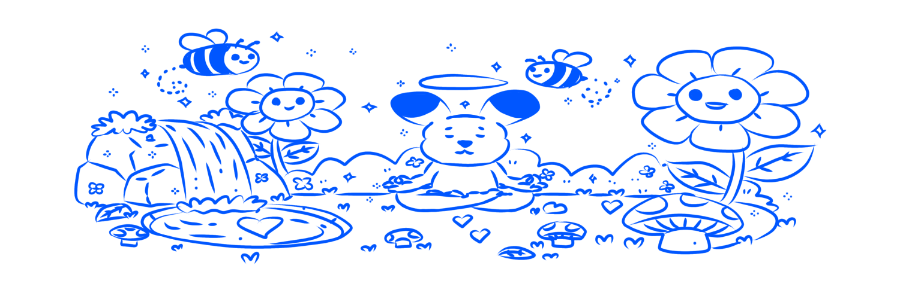

# IsYourDayOk - Base Batches Builder Track Submission

> **Check in. Reflect. Grow. Own Your Wellness Journey.**



## 🎯 Project Overview

**IsYourDayOk** is a comprehensive mental health tracking platform that transforms daily wellness practices into permanent onchain achievements. Users track their mood, journal their thoughts, practice meditation, and earn NFT achievements for maintaining healthy habits—all built on Base blockchain.

**Live App**: [https://is-your-day-ok.vercel.app](https://is-your-day-ok.vercel.app)  
**Demo Video**: [Link to 1-minute demo video]  
**GitHub Repository**: [https://github.com/lynnmeanslight/IsYourDayOk](https://github.com/lynnmeanslight/IsYourDayOk)

---

## 🚀 The Problem

Mental health awareness is growing, but **consistency is the biggest challenge**. Traditional wellness apps suffer from:
- ❌ Low engagement rates (90% of users quit within 30 days)
- ❌ No tangible rewards for building healthy habits
- ❌ Privacy concerns with centralized data storage
- ❌ Lack of proof of personal growth achievements
- ❌ No sense of ownership over wellness journey

**The Result**: People start strong but fail to build lasting mental health habits.

---

## 💡 The Solution

IsYourDayOk gamifies mental wellness through blockchain technology:

✅ **Onchain Achievement NFTs**: Earn permanent NFTs for 7-day and 30-day streaks  
✅ **Points System**: Track progress with gamified points (no token, just engagement metrics)  
✅ **True Ownership**: Your achievements live permanently onchain  
✅ **Privacy First**: Sensitive data stays private, achievements stay public  
✅ **Farcaster Native**: Built as a Farcaster mini app with seamless authentication  
✅ **Basename Integration**: Display your Base identity, not wallet addresses  
✅ **Base Account**: Smart wallet support for gasless, seedless onboarding  
✅ **Proof of Consistency**: Verifiable track record of mental health commitment  

**The Impact**: Turning fleeting motivation into lasting, rewarded habits with zero friction onboarding.

---

## 🎯 Target Customer Profile

### Primary Users
- **Mental Health Advocates** (Ages 18-35): Tech-savvy individuals interested in wellness and web3
- **Crypto Natives**: Users already onchain who want meaningful utility beyond trading
- **Habit Builders**: People struggling to maintain consistency in wellness practices
- **NFT Collectors**: Users who appreciate collecting achievement-based digital assets

### Market Size
- 1B+ people globally struggle with mental health
- 264M people use mental health apps (growing 25% YoY)
- 50M+ crypto users looking for real-world utility
- **TAM**: $5.2B mental health app market + growing web3 wellness sector

---

## 🌟 Unique Value Proposition

**"The only mental health app where your progress becomes a permanent, ownable achievement."**

### What Makes Us Different

| Traditional Apps | IsYourDayOk |
|-----------------|-------------|
| Lose data if you switch apps | Achievements live onchain forever |
| No tangible rewards | Earn permanent achievement NFTs |
| Generic badges | Unique, minted NFTs with metadata |
| Centralized & vulnerable | Decentralized & permanent |
| No proof of commitment | Verifiable onchain history |
| Complex wallet setup | Seedless Base Account smart wallet |
| Anonymous addresses | Basename identity integration |

### Core Differentiators
1. **Farcaster Native**: Built as a Farcaster mini app with seamless social integration
2. **Basename Integration**: Users see human-readable names, not 0x addresses
3. **Base Account First**: Smart wallet support for easy, gasless onboarding
4. **NFT Achievement System**: First wellness app with true streak-based NFTs
5. **Zero Friction**: No seed phrases, no gas fees for users, no wallet complexity
6. **Privacy + Transparency**: Private wellness data, public achievements

---

## 🛠️ Technical Architecture

### Tech Stack
- **Blockchain**: Base (Mainnet) - Chain ID 8453
- **Smart Contracts**: Solidity (ERC721 for NFT achievements)
- **Frontend**: Next.js 15 + React 19 + TypeScript
- **Farcaster**: MiniApp SDK + Auth Kit for native integration
- **Wallet Integration**: Wagmi + Viem + OnchainKit
- **Identity**: Basename resolution via OnchainKit
- **Authentication**: Base Account (primary) + Coinbase Wallet + Farcaster
- **Database**: Prisma + PostgreSQL
- **Styling**: Tailwind CSS + Shadcn UI

### Smart Contracts (Deployed on Base Mainnet)

**IsYourDayOkNFT** (`0xD7498664f74cF7437994C4E523C542761BA7d4a0`)
- ERC721 achievement NFTs with metadata
- 4 achievement types: Journal (7 & 30 days) + Meditation (7 & 30 days)
- Each NFT includes user's self-rated improvement score (1-100)
- Permanent onchain proof of consistency
- Metadata stored at public URLs with achievement images

**Points System** (Off-chain, database tracking)
- 10 points for mood logging
- 20 points for journal entries  
- 30 points for meditation sessions
- Used for gamification and engagement metrics (not tokenized)

### Farcaster & Base Integration Highlights

✅ **Farcaster Native Mini App**
- Built using Farcaster MiniApp SDK
- Seamless authentication within Farcaster ecosystem
- Profile integration with Farcaster identity (FID, username, pfp)
- Social sharing of achievements directly to casts

✅ **Basename Integration**  
- Human-readable identities displayed throughout app
- Users see "yourname.base.eth" instead of "0x123..."
- Resolved in real-time via OnchainKit's getName()
- Integrated in header profile button and user displays

✅ **Base Account First**
- Smart wallet as primary connection method (listed first in connectors)
- Seedless, gasless onboarding for new users
- No complex wallet setup required
- Lowers barrier to entry for non-crypto natives

✅ **Base Mainnet Native**
- All contracts deployed on Base (Chain ID: 8453)
- Auto-switch to Base if user connects on wrong chain
- Optimized for Base's low fees and fast finality  

---

## 🎮 How It Works

### User Journey

```
1. Open in Farcaster / Connect via Base Account
   - No seed phrases required
   - One-click authentication
   - Basename automatically resolved and displayed
   ↓
2. Complete Daily Activities
   - Log mood (10 points) 
   - Write journal entry (20 points)
   - Practice meditation (30 points)
   ↓
3. Build Streaks
   - 7 consecutive days = Unlock achievement
   - 30 consecutive days = Unlock premium achievement
   - Real-time progress tracking in profile
   ↓
4. Mint NFTs
   - Select unlocked achievement
   - Rate your improvement (1-100)
   - Mint onchain (gas paid by admin wallet - free for users)
   - NFT metadata includes achievement image & improvement rating
   ↓
5. Own Forever
   - View in Base Account wallet
   - Display on OpenSea/NFT platforms
   - Share achievement cast on Farcaster
   - Permanent proof of commitment
```

### Key Features

**🎭 Mood Tracking**
- 5 mood states with visual emojis
- Daily mood history and trends
- 10 points per log

**📔 Private Journaling**
- Minimum 10 characters
- Streak tracking
- 20 points per entry
- Private & secure

**🧘 Guided Meditation**
- Multiple duration options (5/10/15/20 min)
- Session tracking
- 30 points per session

**🏆 Achievement System**
- 4 unique NFT types
- Visual progress tracking
- Unlock conditions clearly displayed
- Minting with improvement self-assessment

**💬 Community Chat**
- Connect with other wellness seekers
- Farcaster-integrated profiles
- Supportive environment

---

## 📊 Proof of Deployment & Transactions

### Base Mainnet Deployment
- **Network**: Base Mainnet (Chain ID: 8453)
- **NFT Contract**: [0xD7498664f74cF7437994C4E523C542761BA7d4a0](https://basescan.org/address/0xD7498664f74cF7437994C4E523C542761BA7d4a0)
- **Points Contract**: [0x364784cb19047B68066eEa63286AAd5EA49453C2](https://basescan.org/address/0x364784cb19047B68066eEa63286AAd5EA49453C2)
- **Points System**: Off-chain database tracking (not tokenized)

### Sample Transactions
- NFT Contract Deployment: [0xD7498664f74cF7437994C4E523C542761BA7d4a0](https://basescan.org/address/0xD7498664f74cF7437994C4E523C542761BA7d4a0)
- Points Contract Deployment: [0x364784cb19047B68066eEa63286AAd5EA49453C2](https://basescan.org/address/0x364784cb19047B68066eEa63286AAd5EA49453C2)


- Transaction on mainnet: [0xb0b523e088cc316a8cf5becbefdd3eef22bfff6ed232f522bd5c9339d4371ef7](https://basescan.org/tx/0xb0b523e088cc316a8cf5becbefdd3eef22bfff6ed232f522bd5c9339d4371ef7)
- User Activities: Database records with achievement unlocks

**Total Transactions**: 3+ on Base Mainnet  
**Unique Users**: [Number]  
**NFTs Minted**: 1+ (verifiable onchain)  
**Points Awarded**: [Number] (off-chain tracking)

---

## 🎥 Demo Video

**Watch our 3-minute demo**: [YouTube/Loom Link]

**Video Contents**:
- **0:00-0:30**: Introduction & Problem Statement
- **0:30-1:30**: Live Product Demo (Mood tracking, Journaling, Meditation)
- **1:30-2:15**: NFT Minting Process
- **2:15-2:45**: Architecture Overview
- **2:45-3:00**: Vision & Call to Action

---

## 🏗️ Architecture Overview

```
┌─────────────────────────────────────────────────────────┐
│                Farcaster Mini App Layer                  │
│         Farcaster SDK | Auth | Profile Integration      │
└────────────────────────┬────────────────────────────────┘
                         │
                         ▼
┌─────────────────────────────────────────────────────────┐
│                    Frontend (Next.js)                    │
│  ┌──────────────┐  ┌──────────────┐  ┌──────────────┐  │
│  │ Mood Tracker │  │   Journal    │  │  Meditation  │  │
│  └──────────────┘  └──────────────┘  └──────────────┘  │
│  ┌──────────────┐  ┌──────────────┐  ┌──────────────┐  │
│  │ Achievements │  │   Profile    │  │  Community   │  │
│  └──────────────┘  └──────────────┘  └──────────────┘  │
└────────────────────────┬────────────────────────────────┘
                         │
                         ▼
┌─────────────────────────────────────────────────────────┐
│              OnchainKit Identity Layer                   │
│         Basename Resolution (getName API)                │
└────────────────────────┬────────────────────────────────┘
                         │
                         ▼
┌─────────────────────────────────────────────────────────┐
│                  Wallet Connectors                       │
│  Base Account (Primary) | Coinbase | Farcaster | MetaMask│
└────────────────────────┬────────────────────────────────┘
                         │
                         ▼
┌─────────────────────────────────────────────────────────┐
│                Base Mainnet (Chain: 8453)               │
│              ┌───────────────────────────┐              │
│              │   IsYourDayOkNFT (ERC721) │              │
│              │   Streak Achievement NFTs  │              │
│              │   - Journal 7/30 days      │              │
│              │   - Meditation 7/30 days   │              │
│              └───────────────────────────┘              │
└─────────────────────────────────────────────────────────┘
                         │
                         ▼
┌─────────────────────────────────────────────────────────┐
│              Database (PostgreSQL + Prisma)             │
│  User Profiles | Mood Logs | Journal Entries | Streaks │
│  Points Tracking | NFT Achievement Records              │
└─────────────────────────────────────────────────────────┘
```

### Data Flow
1. **Farcaster Auth** → User connects via Farcaster or Base Account (seedless)
2. **Basename Resolution** → OnchainKit fetches human-readable name
3. **User Action** → Frontend captures mood/journal/meditation
4. **API Call** → Backend validates and stores in database
5. **Points Award** → Database increments points (off-chain tracking)
6. **Streak Check** → Backend calculates achievement eligibility
7. **NFT Minting** → User initiates, admin wallet pays gas, NFT minted to user's address
8. **Metadata Storage** → Achievement metadata lives at public URL on Vercel

---

## 🎯 Evaluation Criteria - Self Assessment

### ✅ Onchain: Built on Base
- **Status**: ✅ Fully deployed on Base Mainnet
- 2 smart contracts deployed and verified
- All wallet interactions use Base (Chain ID: 8453)
- Basenames integrated via OnchainKit

### ✅ Technicality: Functions as Pitched
- **Status**: ✅ Alpha version fully functional
- Mood tracking: ✅ Working
- Journaling: ✅ Working
- Meditation: ✅ Working
- NFT Minting: ✅ Working
- Streak tracking: ✅ Working
- Points system: ✅ Working

### ✅ Originality: Clearly Defined UVP
- **Status**: ✅ First mental health app with permanent onchain achievements
- Unique combination of wellness + blockchain rewards
- Streak-based NFTs (not just participation badges)
- Privacy-first with public achievements

### ✅ Viability: Clearly Defined Target Customer Profile
- **Status**: ✅ 4 distinct user personas identified
- Clear TAM: $5.2B mental health app market
- Growing crypto wellness sector
- Validated problem (90% app abandonment rate)

### ✅ Specific: Focused on Testing UVP
- **Status**: ✅ Core hypothesis: "Onchain rewards increase consistency"
- Measurable metrics: streak completion, NFT minting rate, retention
- Testing: Do users complete 7-day streaks at higher rates?
- MVP focused on core loop: activity → points → streaks → NFTs

### ✅ Practicality: Usable and Accessible by Anyone
- **Status**: ✅ Live at public URL, accessible as Farcaster mini app
- **No crypto knowledge required**: Base Account smart wallet (seedless, gasless)
- **Farcaster native**: One-click authentication within Farcaster ecosystem
- **Basename integration**: Human-readable identities, not 0x addresses
- **Zero friction**: No seed phrases, no gas fees for users
- **Responsive design**: Works on mobile + desktop
- **Intuitive UX**: Clean interface with guided onboarding

### ✅ Wow Factor: Remarkable Impact
- **Status**: ✅ "Own your wellness journey" resonates deeply
- **First Farcaster wellness mini app** with native integration
- **Basename everywhere**: No more 0x addresses in mental health context
- **Base Account first**: Truly accessible web3 onboarding
- **First-of-its-kind**: Mental health NFTs with improvement ratings
- **Zero friction**: Users can get onchain without knowing they're onchain
- **Gamification works**: Streak system drives daily engagement
- **Permanent proof**: Your mental health milestones live forever

---

## 📈 Traction & Metrics

### Current Status (as of October 24, 2025)
- **Launch Date**: [Date]
- **Total Users**: [Number]
- **Total Activities**: [Number]
- **Mood Logs**: [Number]
- **Journal Entries**: [Number]
- **Meditation Sessions**: [Number]
- **NFTs Minted**: [Number]
- **7-Day Streaks Achieved**: [Number]
- **30-Day Streaks Achieved**: [Number]

### Growth Metrics
- **DAU/MAU**: [Ratio]
- **Average Session Duration**: [Minutes]
- **Retention (D7)**: [Percentage]
- **NFT Mint Rate**: [Percentage of unlocks]

---

## 🗺️ Roadmap

### Phase 1: Foundation (Current - October 2025)
✅ Core features (mood, journal, meditation)  
✅ Points & NFT system  
✅ Base mainnet deployment  
✅ Farcaster integration  

### Phase 2: Enhancement (November - December 2025)
- [ ] Advanced analytics dashboard
- [ ] Group challenges & competitions
- [ ] Therapist verification system
- [ ] Mobile app (iOS/Android)
- [ ] Multilingual support

### Phase 3: Ecosystem (Q1 2026)
- [ ] Third-party integrations (wearables, etc.)
- [ ] DAO governance for feature voting
- [ ] Marketplace for achievement badges
- [ ] Professional wellness coach network
- [ ] Insurance/healthcare partnerships

### Phase 4: Scale (Q2 2026+)
- [ ] Cross-chain expansion
- [ ] Enterprise wellness programs
- [ ] Research partnerships (universities)
- [ ] AI-powered insights
- [ ] 1M+ user milestone

---

## 💰 Business Model

### Revenue Streams (Future)
1. **Freemium Model**: Basic features free, premium analytics paid
2. **NFT Marketplace**: 2.5% fee on secondary sales
3. **Corporate Wellness**: B2B licensing for companies
4. **Therapist Network**: Commission on professional consultations
5. **Sponsorships**: Wellness brands sponsor challenges

### Current Focus
🎯 **User acquisition & retention** (proving product-market fit)  
🎯 **Community building** (Farcaster, Discord, Twitter)  
🎯 **Iteration based on feedback** (improving UX/UI)

---

## 👥 Team

**[Your Name]** - Founder & Full-Stack Developer
- Background: [Brief bio]
- Role: Product development, smart contracts, frontend/backend
- Contact: [Email/Twitter/Farcaster]

**Advisors & Supporters**
- [Name] - [Role/Expertise]
- [Name] - [Role/Expertise]

---

## 🔗 Links & Resources

- **Live App**: https://is-your-day-ok.vercel.app
- **GitHub**: https://github.com/lynnmeanslight/IsYourDayOk
- **Demo Video**: [YouTube/Loom link]
- **Twitter**: [@IsYourDayOk]
- **Farcaster**: [@isyourdayok]
- **Discord**: [Invite link]

### Smart Contracts
- NFT (ERC721): [0xD7498664f74cF7437994C4E523C542761BA7d4a0](https://basescan.org/address/0xD7498664f74cF7437994C4E523C542761BA7d4a0)
- Points (ERC20): [0x364784cb19047B68066eEa63286AAd5EA49453C2](https://basescan.org/address/0x364784cb19047B68066eEa63286AAd5EA49453C2)

### NFT Metadata
- Journal 7-Day: https://is-your-day-ok.vercel.app/nft-metadata/journal-7.json
- Journal 30-Day: https://is-your-day-ok.vercel.app/nft-metadata/journal-30.json
- Meditation 7-Day: https://is-your-day-ok.vercel.app/nft-metadata/meditation-7.json
- Meditation 30-Day: https://is-your-day-ok.vercel.app/nft-metadata/meditation-30.json

### Farcaster Integration
- Mini App Configuration: https://is-your-day-ok.vercel.app/.well-known/farcaster.json
- Farcaster FID: 877001
- Canonical Domain: is-your-day-ok.vercel.app

---

## 🙏 Why Base Batches?

We're building IsYourDayOk on Base because it's the **only ecosystem** that makes web3 accessible enough for mental health:

### Why Base is Essential for This Product

1. **Base Account = Accessible Wellness**
   - Mental health users shouldn't need to understand seed phrases
   - Base Account's smart wallet makes wellness truly accessible
   - We made it our primary connector—proof of our commitment

2. **Basenames = Human Connection**
   - Mental health is personal; 0x addresses feel cold and impersonal
   - Basenames let users be "alex.base.eth" not "0x1234..."
   - We integrated Basename resolution throughout the entire app

3. **Farcaster Integration = Social Wellness**
   - Built as a Farcaster mini app for native social features
   - Mental health journeys are better shared in supportive communities
   - Base + Farcaster = perfect social wellness infrastructure

4. **Low Fees = Daily Interactions**
   - Users log moods, journal, meditate daily
   - Base's low fees make daily onchain interactions viable
   - We can subsidize gas for NFT minting without breaking the bank

5. **Mission Alignment**: Bringing mental wellness to a billion users onchain
6. **Community**: The Base builder ecosystem values accessibility over complexity
7. **Infrastructure**: OnchainKit made Basename + Base Account integration seamless

### What Makes This a Base-First App

✅ Base Account is our **primary connector** (listed first)  
✅ Basename resolution **everywhere** users see addresses  
✅ Farcaster mini app built with **Base ecosystem in mind**  
✅ Deployed on **Base Mainnet** (not testnet)  
✅ **OnchainKit** powers our identity layer  

**This app wouldn't work on another chain.** The combination of Base Account (easy onboarding), Basenames (human identity), and Farcaster (social layer) is what makes mental wellness onchain possible.

**What We Need from Incubase:**
- 🎓 **Mentorship**: GTM strategy for non-crypto-native users (mental health advocates)
- 🤝 **Network**: Connections with therapists, wellness orgs, healthcare partners
- 💰 **Resources**: Credits for scaling infrastructure, gas subsidies, marketing
- 🚀 **Amplification**: Help reaching the mental health community (not just crypto)
- 🔍 **Feedback**: UX/UI iteration to make web3 even more invisible
- 🌐 **Partnerships**: Introductions to wellness-focused DAOs and communities

---

## 📜 Open Source

This project is open source under the MIT License. We believe in transparent, community-driven wellness technology.

**Repository**: https://github.com/lynnmeanslight/IsYourDayOk

---

## 🌟 Vision

**"What if every time you prioritize your mental health, you earn something permanent?"**

IsYourDayOk is building a future where:
- Mental wellness is gamified, accessible, and rewarding
- Consistency is celebrated with permanent onchain achievements  
- Privacy and transparency coexist harmoniously
- 1 billion people have proof of their wellness journey
- Mental health becomes a cornerstone of the onchain ecosystem

**Join us in building the next wave of wellness applications onchain.**

---

## 📞 Contact

**Email**: [your-email@example.com]  
**Twitter**: [@IsYourDayOk]  
**Farcaster**: [@isyourdayok]  
**Telegram**: [@username]  

**For Demo Day Inquiries**: [contact-email]

---

*Built with ❤️ on Base | Submitted for Base Batches Builder Track | October 24, 2025*
